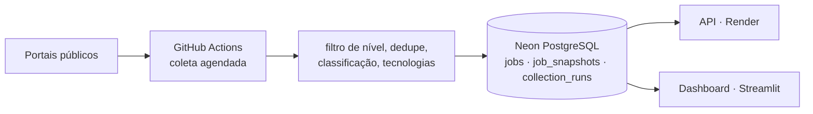

# vagas-tech-junior

Raspagem de vagas de emprego para responder, **com dados reais**, uma pergunta:
qual área de tecnologia (Suporte Técnico, Engenharia de Software, Backend, Data,
Frontend, Mobile, DevOps, QA, Fullstack, Infraestrutura, Service Desk, Sistemas/ERP,
IA, Segurança e mais) tem mais vagas para desenvolvedores júnior no Brasil em 2026?

O projeto coleta vagas em portais públicos, filtra apenas nível de entrada
(júnior/estágio/trainee/aprendiz), remove duplicatas e classifica cada vaga em uma
área de tecnologia por palavras-chave. A coleta roda agendada no GitHub Actions e
grava um histórico no PostgreSQL (Neon), lido por uma API e por um dashboard. CSVs,
gráficos e um relatório em Markdown são opcionais.

### 🔗 API no ar: **[vagas-tech-junior-api.onrender.com/docs](https://vagas-tech-junior-api.onrender.com/docs)**

Documentação interativa — dá para filtrar as vagas pelo navegador, sem instalar
nada. Alguns exemplos diretos:

- [Vagas de Backend remotas](https://vagas-tech-junior-api.onrender.com/vagas?area=Backend&modalidade=Remoto)
- [Ranking das áreas](https://vagas-tech-junior-api.onrender.com/areas)
- [Tecnologias mais pedidas](https://vagas-tech-junior-api.onrender.com/tecnologias?com_vagas=true)

> Hospedada no plano gratuito do Render, que hiberna após 15 minutos sem uso —
> **o primeiro acesso pode levar cerca de 1 minuto**. Os seguintes são imediatos.

### 📊 Dashboard no ar: **[vagas-tech-junior.streamlit.app](https://vagas-tech-junior.streamlit.app/)**

Vagas ativas, empresas, % remoto e distribuição por área, modalidade e fonte, com
filtros, histórico por dia de coleta, lista de vagas e tecnologias mais citadas
(`dashboard/README.md`). Lê a branch Neon `dados-main` com um papel só de leitura;
deploy, verificação e rollback em `docs/deploy.md`.

> Hospedado no plano gratuito do Streamlit Community Cloud, que hiberna depois de
> alguns dias sem acesso. Se aparecer o botão para acordar o app, a subida leva
> cerca de 1 minuto.

---

# Principais achados

> **Números atuais: [dashboard](https://vagas-tech-junior.streamlit.app/)**, com
> filtros por fonte, área, modalidade e período. Os achados abaixo são da análise
> da **coleta de 15/09/2026** (603 vagas de nível de entrada de sete portais, como
> gravadas no banco), reclassificada com a taxonomia de 17 áreas adotada em 21/09
> ([ADR 0008](docs/decisoes/0008-taxonomia-de-areas-expandida.md)).
>
> O relatório [`docs/resultados-2026-09-15.md`](docs/resultados-2026-09-15.md) é
> **registro datado** e mantém a taxonomia de 10 áreas da época: os dois descrevem
> a mesma coleta com vocabulários diferentes.

- **A maior área é "Engenharia de Software" (156 vagas, 25,9%) — e ela é um
  catch-all, de propósito.** São vagas de desenvolvimento que não declaram stack no
  título ("Desenvolvedor Júnior", "Analista de Sistemas Jr"). Antes eram empurradas
  para Backend ou caíam em "Outros". É por isso que Backend aparece com 54 vagas
  aqui e 92 na taxonomia antiga: ela o inflava.
- **Somada, a família de suporte empata com ela**: Suporte Técnico (126),
  Infraestrutura/Redes, Service Desk, Field Service e Hardware dão 153 vagas
  (25,4%). Suporte Técnico sozinho é a segunda maior área. É a terceira coleta
  seguida com suporte no topo entre as especialidades declaradas, cada uma com mais
  fontes (182 → 374 → 597 vagas).
- **"Outros/TI Geral" caiu de 206 para 65 vagas (10,8%)** com a taxonomia nova. O
  que sobra são vagas cujo título não permite inferir área nenhuma ("Estágio em TI",
  "Jovem Aprendiz - Tecnologia"), boa parte sem descrição no card do portal.
- **Mais da metade das vagas com modalidade informada é presencial (54%).** As
  remotas são 29%, mas 64 das 96 vêm de um único agregador (Quero Vagas Tech):
  parte do número é mistura de fontes, não mercado.
- **SQL é a tecnologia mais citada (102 vagas).** Em proporção, a leitura muda por
  área: SQL aparece em 80% das vagas de Data com tecnologia informada, contra 51%
  das de Backend. A família de suporte é dominada por Redes/TCP-IP, Hardware e
  Windows, e Frontend pede JavaScript em 86% das vagas.
- **Data e QA foram as áreas que mais ganharam espaço** entre as coletas: Data de
  5,3% para 9,5%, QA de 4,5% para 6,5%.

## Como esses números foram apurados

Cinco decisões afetaram o resultado mais que qualquer ajuste de código, e todas
vieram de rodar contra dados reais:

- **Um terço das vagas de nível de entrada não era de tecnologia** (314 de 911
  na coleta de 15/09/2026: "Analista Contábil Jr", "Analista Fiscal Jr"). Sem um portão de relevância, o ranking mediria a
  população errada.
- **A área Segurança apareceu com 45 vagas, todas falso positivo**: a palavra
  `segurança` casava com "normas de segurança" no boilerplate de vagas de
  suporte. Depois da correção, a área voltou a um dígito — o número real.
- **`data` não pode ser keyword de Data em português**: casa com "**data** de
  admissão".
- **Keywords contidas em outras somavam duas vezes.** "DESENVOLVEDOR BACKEND
  JÚNIOR - SUSTENTAÇÃO E SUPORTE TÉCNICO" pontuava `suporte técnico` (peso alto)
  *e* `suporte` (peso médio) pelo mesmo trecho, e ia parar em Suporte/Infra (a
  área que hoje se chama Suporte Técnico) por
  15 a 14 em vez de Backend.
- **A mesma vaga aparecia duas vezes quando dois portais a anunciavam**, porque
  cada um escreve o nome da empresa do seu jeito ("Minsait" e "Minsait an Indra
  Company", "FEI" e "Centro Universitário FEI"). Na coleta de 03/08/2026,
  Suporte/Infra caiu de 99 para 87 vagas com a correção — era a Wyntech contada
  em dobro.

As regras estão em três YAMLs comentados, e o CSV traz uma coluna `area_matches`
com as keywords que dispararam cada classificação, para auditoria.

Limitações conhecidas estão em [Limitações honestas](#limitações-honestas).

---

## Como funciona

Nove portais na coleta padrão: Gupy, Vagas.com.br, Trampos.co, LinkedIn, Quero
Vagas Tech, GeekHunter, Solides, Recrutei e Abler. A ProgramaThor funciona só localmente, e Catho e Indeed
estão bloqueados ([docs/fontes.md](docs/fontes.md)).



Cada componente, com links para o detalhe: **[docs/architecture.md](docs/architecture.md)**.
Por que cada peça existe, e o que ficou de fora de propósito (Airflow, dbt,
camadas de medalhão): **[docs/decisoes/](docs/decisoes/README.md)**.

| Documento | Conteúdo |
|---|---|
| [Fontes de dados](docs/fontes.md) | como cada portal é acessado, particularidades descobertas ao vivo, Catho e Indeed bloqueados |
| [Classificação](docs/classificacao.md) | portão "é vaga de tech?", área, modalidade, tecnologias, gráficos e como editar as regras |
| [API, banco e deploy](docs/api.md) | endpoints, Docker, `DATABASE_URL`, datas e deploy da API no Render |
| [Dashboard](dashboard/README.md) | páginas, definições e filtros; deploy em [docs/deploy.md](docs/deploy.md) |
| [Modelo de dados](docs/data-model.md) | `jobs`, `job_snapshots`, `collection_runs` e a persistência idempotente |
| [Automação](docs/automation.md) · [Qualidade](docs/data-quality.md) · [Observabilidade](docs/observability.md) | coleta agendada, checagens de qualidade, frescor e playbook |
| [Limitações](docs/limitacoes.md) | limites éticos, técnicos, de frequência e de amostra |

---

## Quickstart local (sem banco nem segredos)

Requer Python 3.11+ (o CI testa 3.11 e 3.13).

```bash
git clone https://github.com/EmidioLP/vagas-tech-junior.git
cd vagas-tech-junior
python -m venv venv
```

Ative o ambiente virtual com `venv\Scripts\activate` no Windows ou
`source venv/bin/activate` no Linux/macOS. Depois:

```bash
pip install -r requirements.txt
```

Uma coleta pequena, só com a Gupy e uma página por termo, gravando arquivos em
`output/` em vez do banco (precisa de internet, e leva alguns minutos):

```bash
python main.py --no-db --csv --sources gupy --max-pages 1
```

Sem `--sources` e `--max-pages`, a coleta usa as 7 fontes padrão e 13 termos de
busca, e leva bem mais tempo.

**Alternativa só com Docker, sem coletar:** `docker compose up --build` sobe a API com
um PostgreSQL local, aplica as migrations e carrega `seed/vagas.csv` (a coleta de
15/09/2026). A API fica em **http://localhost:8000/docs**. Detalhes em
[docs/api.md](docs/api.md#docker-api--postgresql).

Testes, também sem rede:

```bash
python -m pytest -q
```

Os parsers são testados contra respostas reais capturadas dos portais, e a
persistência contra um SQLite temporário criado pelas migrations.

## Coleta com banco

O banco é a fonte de verdade. Configure a `DATABASE_URL` (um PostgreSQL; veja
[docs/api.md](docs/api.md#banco) e [docs/neon-setup.md](docs/neon-setup.md)),
aplique as migrations e colete:

```bash
alembic upgrade head
```

```bash
python main.py
```

O banco é validado **antes** de coletar: sem `DATABASE_URL`, sem conexão ou com
o schema desatualizado, o comando para na hora com uma mensagem clara. Rodar de
novo é seguro, porque a gravação é idempotente e não duplica vagas nem histórico
(detalhes em [docs/data-model.md](docs/data-model.md#persistência)). No fim, o
comando mostra o resumo da gravação: vagas criadas e atualizadas, snapshots
criados e ignorados (sem mudança) e falhas. Com alguma falha, sai com código 1.

Outros exemplos:

```bash
python main.py --csv
```

```bash
python main.py --terms "engenheiro de dados junior" "estagio dados" --max-pages 3
```

```bash
python main.py --strict --delay 3
```

### Opções

| Flag | Efeito |
|------|--------|
| `--sources gupy vagas` | Quais portais consultar (padrão: os 7 da coleta padrão; `programathor` só explicitamente) |
| `--terms "..." "..."` | Substitui a lista padrão de termos |
| `--max-pages N` | Máximo de páginas por termo, por portal (padrão 5) |
| `--page-size N` | Vagas por página (a Gupy limita a 100) |
| `--delay S` | Segundos entre requests (padrão 1.5) |
| `--output DIR` | Diretório de saída (padrão `./output`) |
| `--strict` | Descarta títulos mistos como "Desenvolvedor Júnior/Pleno" |
| `--all-levels` | Não filtra por senioridade |
| `--keep-non-tech` | Mantém vagas fora de tecnologia que a busca solta devolve |
| `--csv` | Também exporta CSVs, relatório e gráficos em `--output` |
| `--no-db` | Não grava no banco (exige `--csv`) |
| `--db DESTINO` | Outro banco: URL ou arquivo SQLite (vence a `DATABASE_URL`) |
| `--no-charts` | Com `--csv`, não gera os gráficos PNG |
| `--resumo ARQUIVO` | Grava um resumo em Markdown, sem URL nem credenciais (usado pelo Actions) |
| `--respect-interval` | Pula a coleta se `COLLECTION_INTERVAL_DAYS` ainda não passou ([docs/automation.md](docs/automation.md)) |
| `--trigger` | Quem disparou (`local`, `manual`, `schedule`), gravado em `collection_runs` |
| `-v` | Log detalhado |

## Saídas

**Banco:** `jobs` guarda a identidade e o ciclo de vida de cada vaga, e
`job_snapshots` o estado observado. Um snapshot novo só é gravado quando a vaga
muda. Veja [docs/data-model.md](docs/data-model.md).

**Arquivos**, só com `--csv`, gravados em `output/` (ignorado pelo git) com
timestamp no nome:

- `vagas_<timestamp>.csv` — todas as vagas classificadas, uma por linha, com
  área, senioridade, empresa, local, URL, tecnologias citadas (coluna `skills`)
  e quais keywords dispararam a classificação (coluna `area_matches`, útil para
  depurar as regras).
- `ranking_areas_<timestamp>.csv` — ranking de áreas por quantidade de vagas.
- `skills_por_area_<timestamp>.csv` — tecnologias mais pedidas em cada área,
  em formato longo (`area, posicao, tecnologia, vagas`).
- `relatorio_<timestamp>.md` — relatório legível: ranking, distribuição por
  senioridade e portal, tecnologias mais pedidas, top empresas e amostra de
  vagas por área.
- `grafico_areas_<timestamp>.png` — distribuição das vagas por área.
- `grafico_modalidade_<timestamp>.png` — composição por remoto / híbrido / presencial / não informado.
- `grafico_skills_<timestamp>.png` — tecnologias mais pedidas por área.

Os gráficos saem em PNG (200 dpi). Use `--no-charts` para pular essa etapa.

Os CSVs saem em `utf-8-sig`, então abrem direto no Excel com acentuação correta.

---

## Limitações honestas

Resumo; a lista completa, com o porquê de cada item, está em
**[docs/limitacoes.md](docs/limitacoes.md)**.

- **É uma amostra, não o mercado inteiro.** O resultado depende dos termos de
  busca e dos portais, e poucas fontes grandes (LinkedIn, Quero Vagas Tech) pesam
  muito nos percentuais.
- **Catho e Indeed estão bloqueados** e a ProgramaThor bloqueia IP de nuvem.
  Nenhum dado é simulado no lugar deles.
- **Classificação por keyword erra em casos ambíguos**, e as vagas do LinkedIn
  anteriores a 22/09/2026, sem descrição, foram classificadas só pelo título. A
  coluna `area_matches` mostra o que disparou cada classificação.
- **Modalidade inferida em parte.** Quando o portal não informa (LinkedIn,
  Vagas.com), a modalidade é lida no texto da vaga; o que ele não diz fica "Não
  informado".
- **Uma coleta por dia:** vagas muito curtas podem não aparecer, e o
  encerramento de uma vaga é registrado com atraso.
- **Mudar as regras não reclassifica o passado:** o histórico mistura versões das
  regras de classificação.
- **Coleta de dados públicos com carga pequena e `robots.txt` respeitado**, mas
  sujeita aos termos de uso de cada portal.

---

## Licença

[MIT](LICENSE) — use, modifique e redistribua à vontade, mantendo o aviso de
copyright.

A licença cobre **o código deste repositório**, não os dados coletados. As vagas
pertencem aos portais e às empresas que as publicaram; raspá-las está sujeito
aos termos de uso de cada site, que a licença não altera. Nenhum dado raspado é
versionado aqui além do snapshot em `seed/`, usado para subir a API localmente.
