# Arquitetura

Como uma vaga sai de um portal e chega à API e ao dashboard, o que cada peça faz
e onde está o detalhe de cada uma. Tudo aqui descreve o que o repositório faz
hoje; o porquê das escolhas está nos ADRs de [`decisoes/`](decisoes/README.md).

## Fluxo

```mermaid
flowchart LR
    portais["Portais públicos<br/>6 na coleta padrão<br/>(ProgramaThor só local)"]

    subgraph actions["GitHub Actions"]
        collect["collect.yml<br/>cron diário 09:00 UTC<br/>+ disparo manual"]
        ci["ci.yml<br/>pytest, sem segredos"]
    end

    subgraph pipeline["main.py → scraper/pipeline.py"]
        guarda["execucao.py<br/>guarda de intervalo"]
        coleta["sources/*<br/>coleta por fonte e termo"]
        filtros["seniority.py → dedupe.py<br/>→ classifier.py → skills.py"]
        grava["persistence/repositorio.py<br/>upsert + snapshot por hash"]
        qual["qualidade.py<br/>checagens de plausibilidade"]
        encerra["encerrar_ausentes<br/>fecha vagas sumidas"]
        registra["persistence/execucoes.py<br/>registra a execução"]
        csv["export.py + charts.py<br/>CSV, .md, PNG (só --csv)"]
    end

    subgraph neon["Neon PostgreSQL · branch dados-main"]
        jobs[("jobs")]
        snaps[("job_snapshots<br/>+ job_snapshot_tecnologias")]
        runs[("collection_runs")]
    end

    subgraph leitura["Leitura compartilhada"]
        foto["persistence/foto_atual.py"]
        frescor["persistence/frescor.py"]
    end

    api["api/ · FastAPI<br/>Render (free)"]
    dash["dashboard/ · Streamlit<br/>Community Cloud"]

    collect --> guarda
    guarda -- "intervalo passou<br/>ou disparo manual" --> coleta
    portais --> coleta
    coleta --> filtros --> grava
    filtros -. "--csv" .-> csv
    grava --> jobs
    grava --> snaps
    grava --> qual --> encerra --> jobs
    guarda -- "lê última coleta" --> runs
    encerra --> registra --> runs
    guarda -- "pulada" --> registra

    jobs --> foto
    snaps --> foto
    runs --> frescor
    foto --> api
    foto --> dash
    frescor --> api
    frescor --> dash
```



As setas seguem a ordem de `pipeline.run`: `_processar` (filtros, gravação e o
CSV opcional) → `_aplicar_politica` (qualidade) → `_encerrar_vagas_ausentes` →
`_registrar_execucao`. A guarda consulta `collection_runs` antes de coletar, e uma
execução pulada também é registrada. Sem banco (`--no-db --csv`), só existem os
passos de coleta, filtros e exportação.

## Componentes

| Componente | O que faz | Detalhe |
|---|---|---|
| Portais | Seis fontes públicas na coleta padrão (`DEFAULT_SOURCES`). A ProgramaThor fica fora porque bloqueia IP de nuvem; Catho e Indeed estão bloqueados e nada é simulado. | [`fontes.md`](fontes.md) |
| `collect.yml` | O cron acorda todo dia e roda `python main.py --trigger schedule --respect-interval`; quem decide se coleta é a guarda de intervalo, não o cron. | [`automation.md`](automation.md) |
| `ci.yml` | Roda a suíte em Python 3.11 e 3.13, sem secrets e sem rede. | [`automation.md`](automation.md#ci) |
| Guarda de intervalo (`scraper/execucao.py`) | Pula a coleta se ainda não passaram `COLLECTION_INTERVAL_DAYS` (2) dias desde a última coleta completa. | [`automation.md`](automation.md#frequência-cron-diário--guarda-de-intervalo) |
| Coleta (`scraper/sources/`) | Uma classe por portal; falha de um termo ou de uma fonte não derruba as outras. | [`fontes.md`](fontes.md) |
| Filtros e classificação | Nível de entrada → dedupe → portão "é vaga de tech?" → área por keywords ponderadas → tecnologias citadas, com regras em `scraper/rules/*.yml`. | [`classificacao.md`](classificacao.md) |
| Persistência (`persistence/repositorio.py`) | Upsert idempotente em `jobs` por `(source, external_id)` e snapshot novo só quando o `content_hash` muda. | [`data-model.md`](data-model.md#persistência) |
| Qualidade (`scraper/qualidade.py`) | Alertas de plausibilidade; um alerta alto impede a fonte de encerrar vagas e deixa o job vermelho. | [`data-quality.md`](data-quality.md) |
| Encerramento | Fecha vagas ausentes em duas coletas confiáveis de dias diferentes. Nada é apagado. | [`data-model.md`](data-model.md#vagas-encerradas-is_active--false) |
| `collection_runs` | Uma linha por execução com banco, puladas inclusive: status, contagens, alertas e próxima coleta. | [`data-model.md`](data-model.md#controle-de-execuções-collection_runs) |
| Exportação (`--csv`) | CSVs, relatório Markdown e gráficos PNG em `output/`. É opcional e nunca pré-requisito do banco. | [README, Saídas](../README.md#saídas) |
| Neon (`dados-main`) | PostgreSQL gerenciado; branches separam desenvolvimento e dados reais. Migrations via Alembic, aplicadas à mão. | [`neon-setup.md`](neon-setup.md), [`migrations.md`](migrations.md) |
| `foto_atual.py` | A regra única de "estado atual": cada vaga com seu snapshot mais recente. API e dashboard usam a mesma consulta, e um teste compara os números. | [`data-model.md`](data-model.md#estado-atual-persistencefoto_atualpy) |
| `frescor.py` | Diz se os dados estão em dia, vencidos ou se a coleta parou, a partir de `collection_runs`. | [`observability.md`](observability.md#frescor-persistencefrescorpy) |
| API (`api/`) | FastAPI somente leitura no Render; `/health` é liveness e `/health/dados` é frescor. | [`api.md`](api.md) |
| Dashboard (`dashboard/`) | Streamlit somente leitura no Community Cloud, com um papel Postgres só de leitura. | [`../dashboard/README.md`](../dashboard/README.md), [`deploy.md`](deploy.md) |

Fora do fluxo publicado, `docker compose up --build` sobe a API com um PostgreSQL
local, aplica as migrations e carrega `seed/vagas.csv` (coleta de 15/09/2026) por
`scripts/carregar_seed.py`, sem rede e sem segredos ([`api.md`](api.md#docker-api--postgresql)).

## O que não existe, de propósito

- **Orquestrador (Airflow, Prefect):** o GitHub Actions agenda, isola e registra.
  [ADR 0003](decisoes/0003-github-actions-em-vez-de-airflow.md)
- **Camadas Bronze/Silver/Gold e dbt:** `jobs`/`job_snapshots` já são o dado
  normalizado com histórico. [ADR 0004](decisoes/0004-sem-medalhao-nem-dbt.md)
- **Ferramenta de qualidade dedicada:** as regras são Python puro.
  [ADR 0006](decisoes/0006-qualidade-em-python.md)
- **Stack de métricas e monitor automático:** a observabilidade usa o que já é
  registrado. O monitor externo é um passo manual e opcional, que o repositório não cria
  ([`observability.md`](observability.md#monitor-externo-manual-opcional)).
- **Scraper no servidor da API:** portais bloqueiam IP de nuvem, e a API só lê.
- **Escrita pela API:** `POST`/`PUT`/`DELETE` respondem 405.

## Estrutura do repositório

```
vagas-tech-junior/
├── main.py                  # CLI: monta Settings e chama pipeline.run()
├── requirements*.txt        # completo, só API (Render/Docker), só dashboard
├── alembic.ini, migrations/ # schema versionado (URL vem de scraper/config.py)
├── Dockerfile, docker-compose.yml   # API + PostgreSQL local com o seed
├── render.yaml              # deploy da API
├── neon.ts                  # configuração declarativa do Neon, sem segredo
├── .github/workflows/       # ci.yml e collect.yml
├── scraper/
│   ├── config.py            # Settings, termos de busca, DATABASE_URL
│   ├── pipeline.py          # orquestração da execução
│   ├── execucao.py          # guarda de intervalo e agenda (puro)
│   ├── qualidade.py         # checagens de qualidade (puro)
│   ├── models.py            # dataclass Job, normalização de texto
│   ├── http_client.py       # sessão educada: delay + retry + UA
│   ├── seniority.py, dedupe.py, classifier.py, skills.py
│   ├── export.py, charts.py # saídas do --csv
│   ├── rules/               # areas.yml, seniority.yml, skills.yml
│   └── sources/             # base.py (contrato JobSource) + um arquivo por portal:
│                            # gupy, vagas_com, programathor, trampos, linkedin,
│                            # querovagastech, geekhunter
├── persistence/
│   ├── repositorio.py       # upsert idempotente, snapshots, encerramento
│   ├── assinatura.py        # content_hash dos snapshots
│   ├── execucoes.py         # collection_runs
│   ├── foto_atual.py        # estado atual, lido pela API e pelo dashboard
│   └── frescor.py           # dados em dia / vencidos / coleta parada
├── api/                     # API REST somente leitura
│   ├── app.py               # FastAPI, /docs, /health, /health/dados, handlers de erro
│   ├── database.py          # engine e sessão SQLAlchemy (lazy)
│   ├── models.py            # tabelas: jobs, job_snapshots, tecnologias, collection_runs
│   ├── schemas.py           # Pydantic (respostas)
│   ├── crud.py              # consultas e filtros, sobre foto_atual
│   ├── dates.py             # normalização das datas para DATE
│   ├── vocabulary.py        # áreas e tecnologias, lidas dos YAMLs
│   └── routers/             # vagas, areas, tecnologias
├── dashboard/               # Streamlit somente leitura
│   ├── app.py               # entrypoint, cache e navegação
│   ├── config.py            # engine só de leitura
│   ├── consultas.py         # todas as consultas (funções puras)
│   └── paginas.py           # páginas
├── scripts/
│   ├── carregar_seed.py     # seed/vagas.csv → histórico de um banco local
│   ├── medir_serie_historica.py  # custo da série do dashboard (ADR 0007)
│   └── sanitizar_log.py     # limpa o log da coleta antes de publicar
├── seed/vagas.csv           # coleta de 15/09/2026, para subir a API localmente
├── docs/                    # este diretório
└── tests/                   # sem rede; tests/api e tests/dashboard à parte
```

## Mapa dos documentos

| Documento | Para quê |
|---|---|
| [`decisoes/`](decisoes/README.md) | ADRs: por que cada peça existe e o que mudaria a decisão |
| [`fontes.md`](fontes.md) | Como cada portal é acessado, particularidades e portais bloqueados |
| [`classificacao.md`](classificacao.md) | Portão de relevância, área, modalidade, tecnologias e gráficos |
| [`data-model.md`](data-model.md) | Tabelas, invariantes, persistência e `collection_runs` |
| [`data-quality.md`](data-quality.md) | Regras de qualidade, limites e efeito no status |
| [`automation.md`](automation.md) | CI, coleta agendada, secrets e diagnóstico |
| [`observability.md`](observability.md) | Frescor, correlação e playbook de incidentes |
| [`api.md`](api.md) | Endpoints, Docker, configuração do banco e deploy da API |
| [`deploy.md`](deploy.md) | Deploy do dashboard e papel só de leitura |
| [`neon-setup.md`](neon-setup.md) | Branches Neon, URL e migrations na `dados-main` |
| [`migrations.md`](migrations.md) | Fluxo do Alembic |
| [`limitacoes.md`](limitacoes.md) | Limites éticos, técnicos e de amostra |
| [`rollback-merge.md`](rollback-merge.md) | Operação: desfazer um merge na `main` |
| [`resultados-2026-09-15.md`](resultados-2026-09-15.md) | Relatório datado de uma coleta |
| [`final-audit.md`](final-audit.md) | Auditoria final datada (16/09/2026): comandos, evidências, pendências e recomendações |
| [`baseline.md`](baseline.md) | Registro histórico: estado do projeto em 15/09/2026, antes da plataforma de dados |
| [`roadmap-status.md`](roadmap-status.md) | Etapas do roadmap |
