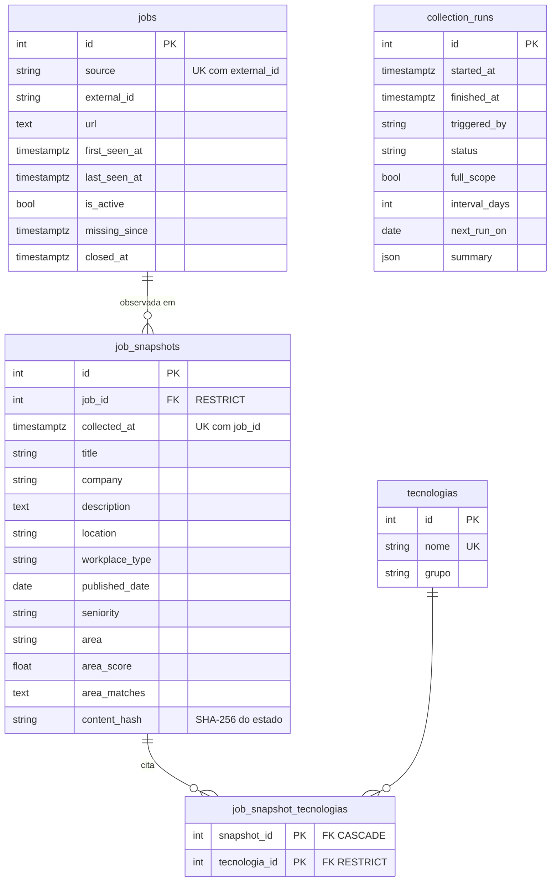

# Modelo de dados

O banco tem dois grupos de tabelas, na mesma metadata (`api/models.py`) e nas
mesmas migrations (`migrations/versions/`):

- **Histórico** — `jobs`, `job_snapshots` e `job_snapshot_tecnologias`: identidade
  estável de cada vaga e o que foi observado nela a cada coleta. Criado na etapa
  03 e **gravado direto pelo pipeline** desde a etapa 04 (veja
  [Persistência](#persistência)). É o que a API e o dashboard leem. As
  tecnologias citadas ficam em `tecnologias`, semeada a partir de `skills.yml`.
- **Controle** — `collection_runs`: uma linha por execução do pipeline com banco,
  inclusive as puladas pela guarda de intervalo. Criada na etapa 06 (veja
  [Controle de execuções](#controle-de-execuções-collection_runs)).



## Identidade × estado

**Mesma vaga não é o mesmo dado.** Uma vaga pode continuar aberta e mudar título,
descrição, modalidade ou área. Por isso:

- **`jobs` é identidade e ciclo de vida.** Só guarda o que identifica a vaga
  (`source`, `external_id`, `url`) e quando ela foi vista (`first_seen_at`,
  `last_seen_at`, `is_active`).
- **`job_snapshots` é o estado observado.** Cada linha é o retrato da vaga numa
  coleta. Tudo que pode mudar entre coletas fica aqui, nunca em `jobs`.

Classes ORM: `JobRecord` (`jobs`) e `JobSnapshot` (`job_snapshots`). O nome
`JobRecord` evita colidir com a dataclass `scraper.models.Job`, que representa a
vaga em memória durante a coleta.

## Campos

### `jobs` — `JobRecord`

| Coluna | Tipo | Regra |
|---|---|---|
| `id` | inteiro | PK |
| `source` | `varchar(20)` | obrigatório; portal (`gupy`, `linkedin`, …) |
| `external_id` | `varchar(100)` | obrigatório; id da vaga no portal. 100 porque a GeekHunter publica o id como hash de 64 caracteres; um id nunca é cortado |
| `url` | `text` | opcional |
| `first_seen_at` | `timestamptz` | obrigatório; primeira coleta que viu a vaga |
| `last_seen_at` | `timestamptz` | obrigatório; última coleta que viu a vaga |
| `is_active` | `boolean` | obrigatório; padrão `true`; `false` quando a vaga é encerrada (veja [Vagas encerradas](#vagas-encerradas-is_active--false)) |
| `missing_since` | `timestamptz` | primeira coleta confiável em que a vaga sumiu da listagem; nulo quando ela reaparece |
| `closed_at` | `timestamptz` | coleta que encerrou a vaga; nulo enquanto ativa |

Restrições e índices: `uq_jobs_source_external_id`, `ix_jobs_is_active`,
`ix_jobs_last_seen_at`.

### `job_snapshots` — `JobSnapshot`

| Coluna | Tipo | Regra |
|---|---|---|
| `id` | inteiro | PK |
| `job_id` | inteiro | obrigatório; FK `jobs.id` `ON DELETE RESTRICT` |
| `collected_at` | `timestamptz` | obrigatório; momento da coleta |
| `title` | `varchar(300)` | obrigatório |
| `company` | `varchar(200)` | |
| `description` | `text` | |
| `location` | `varchar(200)` | |
| `workplace_type` | `varchar(20)` | Remoto / Híbrido / Presencial / Não informado |
| `published_date` | `date` | data de publicação informada pelo portal |
| `seniority` | `varchar(20)` | |
| `area` | `varchar(40)` | área classificada naquela coleta |
| `area_score` | `float` | |
| `area_matches` | `text` | keywords que dispararam a área, para auditoria |
| `content_hash` | `varchar(64)` | obrigatório; assinatura do estado gravado (veja [Assinatura](#assinatura-content_hash)) |

Restrições e índices: `uq_job_snapshots_job_collected` sobre
`(job_id, collected_at)`, `ix_job_snapshots_collected_at` e `ix_job_snapshots_area`.

Os tamanhos de texto são os mesmos da antiga tabela `vagas`, para aceitar
exatamente os dados que o scraper já produz.

### `job_snapshot_tecnologias`

Associação N:N entre snapshot e `tecnologias`, com PK `(snapshot_id, tecnologia_id)`.
Tecnologia é relação, não string,
para dar para contar e filtrar ao longo do tempo.

## Invariantes

- **Uma vaga por `(source, external_id)`.** O mesmo id em portais diferentes são
  vagas diferentes. As sete fontes sempre informam `external_id`, então os dois
  campos são obrigatórios.
- **No máximo um snapshot por vaga em cada coleta**, garantido por
  `(job_id, collected_at)` único.
- **Histórico não some em silêncio.**
  - Apagar uma vaga que tem snapshots é bloqueado (`RESTRICT`).
  - Apagar uma tecnologia citada em snapshots também é bloqueado.
  - Apagar um snapshot remove só as associações dele (`CASCADE`), nunca a
    tecnologia.
- **Tempo com fuso.** `collected_at`, `first_seen_at` e `last_seen_at` são
  `timestamptz`, porque coletas locais (horário de Brasília) e em CI (UTC) vão
  conviver.
- **Nenhum timestamp tem default no banco.** Quem grava informa a hora da coleta,
  a mesma para todas as vagas daquela execução.

## Persistência

O banco é a fonte de verdade. O pipeline grava direto nele, e o CSV virou
exportação opcional (`python main.py --csv`), que não é pré-requisito de nada.

```
coleta → senioridade → dedupe → portão de tecnologia → área → tecnologias
       → persistence.persistir_vagas  (jobs + job_snapshots)
       → export_all                   (só com --csv)
```

A gravação fica em `persistence/repositorio.py`. As fontes e o pipeline não
escrevem SQL.

**Idempotência:** rodar a mesma coleta de novo produz o mesmo estado final. Uma
segunda execução idêntica não cria vagas nem snapshots; só avança `last_seen_at`.

### Antes de coletar

`pipeline.preparar_banco` confere três coisas antes de gastar minutos coletando:
- a URL do banco (`DATABASE_URL` ou `--db`);
- a conexão;
- o schema atual (`jobs`, `job_snapshots.content_hash` e `collection_runs`).

Qualquer problema gera `ConfiguracaoError`, e a mensagem nunca traz a URL. Cada
execução usa **um único `collected_at`**, em UTC, para todas as vagas.

### `jobs`: upsert por `(source, external_id)`

- **Inserção.** Usa `INSERT … ON CONFLICT (source, external_id) DO NOTHING
  RETURNING id`. Se outra execução gravou a mesma vaga no meio tempo, o conflito
  vira atualização, nunca duplicata. A deduplicação em memória do pipeline só
  reduz ruído dentro de uma coleta; a integridade vem da constraint.
- **Vaga já existente.** `url` recebe o valor novo quando vier preenchida,
  `last_seen_at = max(atual, coleta)`, `first_seen_at = min(atual, coleta)` e
  `is_active = true`. Gravar uma coleta antiga depois de uma nova não faz as
  datas retrocederem.
- **O upsert nunca desativa.** Uma vaga vista tem a ausência zerada e, se estava
  encerrada, volta a ativa. Quem encerra é um passo separado, só com fontes
  confiáveis (veja [Vagas encerradas](#vagas-encerradas-is_active--false)).
- **Identidade nunca é cortada.** `source` ou `external_id` maior que a coluna
  conta como falha. Os campos de texto do snapshot são aparados e cortados no
  tamanho da coluna.

### Vagas encerradas (`is_active = false`)

Portais não avisam que uma vaga foi preenchida. O sinal usado é a vaga **sumir
da listagem em duas coletas seguidas**. `persistence.repositorio.encerrar_ausentes`
roda depois da gravação, só quando dá para confiar na ausência:

- a coleta tem escopo completo e não falhou;
- a fonte terminou com status `ok` e listou pelo menos uma vaga. Fonte vazia sem
  erro pode ser mudança no HTML do portal.

Para cada vaga ativa dessa fonte:

| Situação | Resultado |
|---|---|
| O portal ainda lista a vaga (mesmo que os filtros a descartem) | `missing_since = null` |
| Sumiu e `missing_since` é nulo | `missing_since = collected_at` (primeira ausência) |
| Sumiu de novo, em **outro dia** (UTC) | `is_active = false`, `closed_at = collected_at` |
| Sumiu de novo no mesmo dia | nada: duas coletas no mesmo dia contam como uma |

- **Nada é apagado.** Snapshots e tecnologias ficam; análises históricas sabem
  quando a vaga abriu (`first_seen_at`) e fechou (`closed_at`).
- **Vaga encerrada que reaparece** volta a `is_active = true`, com `closed_at` e
  `missing_since` nulos.
- **Uma transação por fonte.** Erro de banco desfaz só o encerramento daquela
  fonte, vira erro no resumo e faz a execução sair com código 1.
- **Consumidores** (API, dashboard) contam vagas abertas com
  `is_active = true`.

### Estado atual (`persistence/foto_atual.py`)

API e dashboard leem a mesma "foto atual": `vagas_atuais()` junta cada linha de
`jobs` ao seu snapshot mais recente (`max(collected_at)`), uma linha por vaga
única. Área, modalidade, título e tecnologias vêm desse snapshot; quem consulta
decide se filtra `ativa`. Snapshot sem área vira `Sem área`, e sem modalidade,
`Não informado`. Como a regra existe num lugar só, os dois consumidores contam as
mesmas vagas (`tests/api/test_api_equivalencia_dashboard.py`).

### Snapshot: só quando o estado muda

Para cada vaga, o repositório pega o snapshot mais recente com `collected_at` até
o desta coleta:

| Situação | Resultado |
|---|---|
| Não existe snapshot anterior | grava |
| O anterior é **desta mesma coleta** | ignora (no máximo um por coleta, mesmo com a vaga repetida na entrada) |
| O anterior tem o **mesmo `content_hash`** | ignora |
| O hash mudou | grava; os anteriores ficam intactos |

A comparação é só com o imediatamente anterior. Uma vaga que vai de Remoto para
Híbrido e volta para Remoto tem três snapshots, porque as mudanças são o histórico.

### Assinatura (`content_hash`)

A regra está em `persistence/assinatura.py`, versão 1.

- **Algoritmo.** SHA-256 de um JSON canônico (chaves ordenadas, sem espaços,
  UTF-8) contendo `"v": 1` e **exatamente os campos que o snapshot grava**:

  `title`, `company`, `description`, `location`, `workplace_type`,
  `published_date`, `seniority`, `area`, `area_score`, `area_matches`, `tecnologias`

- **Normalização:**
  - texto tem as bordas aparadas, e vazio vira `null`, então `""` e `null` são o mesmo estado;
  - `published_date` vai em ISO;
  - `area_score` vai com 4 casas decimais;
  - `tecnologias` vão ordenadas e sem repetição.
- **Fora do hash:**
  - `url`: identidade, fica em `jobs`;
  - `search_term`: depende de qual termo trouxe a vaga primeiro;
  - `collected_at`.
- **A classificação entra no hash.** Se as regras em `scraper/rules/*.yml`
  mudarem a área ou as tecnologias de uma vaga, a próxima coleta grava um
  snapshot novo. A reclassificação vira histórico, e nenhum campo gravado fica
  desatualizado em silêncio.
- **Datas relativas.** "Há 3 dias" é resolvida contra o dia da coleta, então
  "Há 3 dias" hoje e "Há 4 dias" amanhã dão a mesma data. "Há mais de 30 dias"
  continua andando com o tempo e pode gerar snapshot novo.
- **Mudar o formato** (campos ou normalização) muda todos os hashes e faz a
  próxima coleta regravar um snapshot por vaga. Se for intencional, suba `VERSAO`.
  `tests/test_assinatura.py` fixa o hash v1 de um exemplo para que isso nunca
  aconteça por acidente.
- **Linhas antigas.** Snapshots anteriores à coluna ficaram com hash `''`, que
  nunca casa com um hash real.

### Transações e falhas

- **Uma transação por fonte**, com um **SAVEPOINT por vaga**. A vaga, o snapshot e
  as tecnologias gravam juntos ou nada grava.
- **Erro de dado numa vaga** (`IntegrityError`, `DataError`, `ValueError`) desfaz
  só aquela vaga, conta uma falha e o lote segue.
- **Qualquer outro erro de banco na fonte** (conexão caiu, commit falhou) desfaz a
  fonte inteira. Todas as vagas dela contam como falha.
- **Fontes já confirmadas nunca são afetadas.**
- **SQLite.** `api/database.make_engine` aplica a correção do pysqlite para
  SAVEPOINT funcionar (testes e `--db arquivo.db`).

### Resumo da execução

`persistir_vagas` devolve um `ResumoPersistencia`: vagas criadas e atualizadas,
snapshots criados e ignorados, falhas (no total e por fonte) e a lista de erros
(`fonte:id: TipoDoErro`). O `main.py` imprime o resumo e sai com código 1 se
houver falhas. O status de cada fonte e da execução, e os demais códigos de
saída, estão em `docs/automation.md`.

### Tabelas legadas removidas

Até a etapa 09, a API lia `vagas` e `vaga_tecnologia`, o espelho de um CSV
importado por `scripts/import_csv.py`. Desde então ela usa o
[estado atual](#estado-atual-persistencefoto_atualpy) do histórico, e na etapa 10
(16/09/2026) as duas tabelas e o importador saíram. A migration `85084f63871c`
apaga as tabelas; o downgrade dela as recria **vazias**, sem os dados.

Para ter dados sem rede num banco local, `scripts/carregar_seed.py` grava
`seed/vagas.csv` no histórico pela mesma persistência da coleta, como uma coleta
de 15/09/2026. Ele recusa bancos com linhas em `collection_runs`.

## Controle de execuções (`collection_runs`)

Tabela de controle da automação, sem FK para as outras. Cada execução do pipeline
**com banco** grava uma linha, inclusive quando a guarda de intervalo pula a
coleta. É ela que a guarda consulta, e é o registro auditável de cada disparo:
agendado, manual ou local (`docs/automation.md`).

- Classe ORM: `CollectionRun`.
- Leitura e gravação: `persistence/execucoes.py`.
- Regras de intervalo e de status: `scraper/execucao.py`.

| Coluna | Tipo | Regra |
|---|---|---|
| `id` | inteiro | PK |
| `started_at` | `timestamptz` | obrigatório; o `collected_at` da execução |
| `finished_at` | `timestamptz` | obrigatório |
| `triggered_by` | `varchar(20)` | obrigatório; `schedule`, `manual` ou `local` |
| `status` | `varchar(20)` | obrigatório; `success`, `partial`, `failed` ou `skipped` |
| `full_scope` | `boolean` | obrigatório; todas as fontes da coleta padrão, termos padrão, ≥ 5 páginas por termo e filtro de senioridade |
| `interval_days` | inteiro | X usado pela guarda; nulo em execução forçada |
| `reason` | `text` | motivo do skip, das falhas ou da decisão da guarda |
| `next_run_on` | `date` | próxima coleta prevista (UTC): última coleta completa + X dias, ou o dia seguinte se essa data já passou; nulo quando X não é conhecido |
| `jobs_count` | inteiro | obrigatório; vagas processadas |
| `failures` | inteiro | obrigatório; vagas não gravadas |
| `summary` | `json` | obrigatório; por fonte: status, requests, requests falhos, vagas brutas, nº de avisos e contagens da gravação |

Índice: `ix_collection_runs_status_started_at`, que serve à consulta da guarda.

- **A guarda** usa o maior `started_at` com `full_scope` verdadeiro e status
  `success` ou `partial`.
- **Só contagens em `summary`.** Mensagens de erro ficam fora, porque podem citar
  URL de portal ou dados da conexão.
- **Registrar nunca desfaz a coleta.** Se a linha não puder ser gravada, as vagas
  já gravadas ficam, o erro (só o tipo) aparece no resumo e a execução sai com
  código 1.
- **Execuções sem banco** (`--no-db`) não são registradas e, por isso, não podem
  usar a guarda.

## Onde estão as regras

- Modelos: `api/models.py`
- Migrations: `migrations/versions/` (baseline, histórico, `content_hash`,
  `collection_runs` e encerramento de vagas)
- Testes do encerramento: `tests/api/test_encerramento.py`
- Guarda de intervalo e status por fonte: `scraper/execucao.py` e
  `persistence/execucoes.py`
- Testes da guarda e dos status: `tests/test_execucao.py` e
  `tests/api/test_execucoes.py`
- Persistência: `persistence/repositorio.py` e `persistence/assinatura.py`
- Testes do histórico: `tests/api/test_historico.py`
- Testes da persistência: `tests/api/test_persistencia.py`,
  `tests/api/test_pipeline_persistencia.py` e `tests/test_assinatura.py`
- Como gerar e aplicar migrations: `docs/migrations.md`
