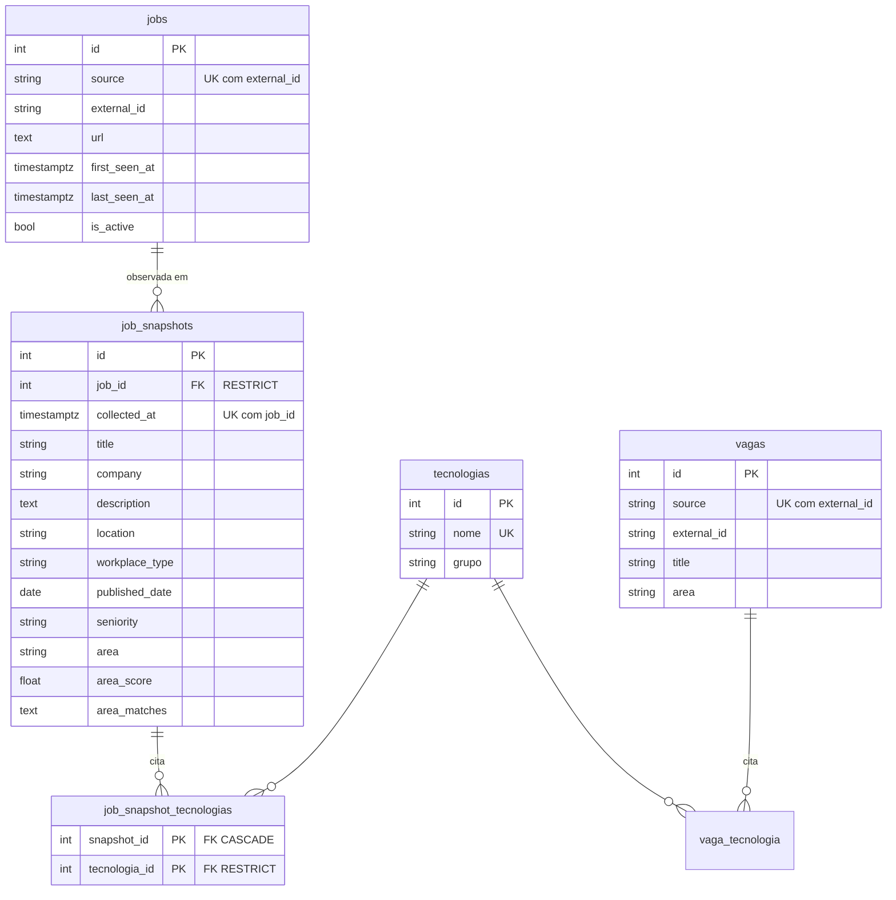

# Modelo de dados

O banco tem dois grupos de tabelas, na mesma metadata (`api/models.py`) e nas
mesmas migrations (`migrations/versions/`):

- **Histórico** — `jobs`, `job_snapshots` e `job_snapshot_tecnologias`: identidade
  estável de cada vaga e o que foi observado nela a cada coleta. Criado na etapa
  03; ainda **não é alimentado** pelo pipeline, o que acontece na etapa 04.
- **Legado** — `vagas` e `vaga_tecnologia`: o espelho do último CSV, que a API
  lê hoje. `tecnologias` é compartilhada pelos dois grupos.

## Identidade × estado

**Mesma vaga não é o mesmo dado.** Uma vaga pode continuar aberta e mudar título,
descrição, modalidade ou área. Por isso:

- **`jobs` é identidade e ciclo de vida.** Só guarda o que identifica a vaga
  (`source`, `external_id`, `url`) e quando ela foi vista (`first_seen_at`,
  `last_seen_at`, `is_active`).
- **`job_snapshots` é o estado observado.** Cada linha é o retrato da vaga numa
  coleta. Tudo que pode mudar entre coletas fica aqui, nunca em `jobs`.

Classes ORM: `JobRecord` (`jobs`) e `JobSnapshot` (`job_snapshots`). O nome
`JobRecord` evita colidir com a dataclass `scraper.models.Job`, que representa a
vaga em memória durante a coleta.

## Campos

### `jobs` — `JobRecord`

| Coluna | Tipo | Regra |
|---|---|---|
| `id` | inteiro | PK |
| `source` | `varchar(20)` | obrigatório; portal (`gupy`, `linkedin`, …) |
| `external_id` | `varchar(40)` | obrigatório; id da vaga no portal |
| `url` | `text` | opcional |
| `first_seen_at` | `timestamptz` | obrigatório; primeira coleta que viu a vaga |
| `last_seen_at` | `timestamptz` | obrigatório; última coleta que viu a vaga |
| `is_active` | `boolean` | obrigatório; padrão `true` |

Restrições e índices: `uq_jobs_source_external_id`, `ix_jobs_is_active`,
`ix_jobs_last_seen_at`.

### `job_snapshots` — `JobSnapshot`

| Coluna | Tipo | Regra |
|---|---|---|
| `id` | inteiro | PK |
| `job_id` | inteiro | obrigatório; FK `jobs.id` `ON DELETE RESTRICT` |
| `collected_at` | `timestamptz` | obrigatório; momento da coleta |
| `title` | `varchar(300)` | obrigatório |
| `company` | `varchar(200)` | |
| `description` | `text` | |
| `location` | `varchar(200)` | |
| `workplace_type` | `varchar(20)` | Remoto / Híbrido / Presencial / Não informado |
| `published_date` | `date` | data de publicação informada pelo portal |
| `seniority` | `varchar(20)` | |
| `area` | `varchar(40)` | área classificada naquela coleta |
| `area_score` | `float` | |
| `area_matches` | `text` | keywords que dispararam a área, para auditoria |

Restrições e índices: `uq_job_snapshots_job_collected` sobre
`(job_id, collected_at)`, `ix_job_snapshots_collected_at` e `ix_job_snapshots_area`.

Os tamanhos de texto são os mesmos de `vagas`, para aceitar exatamente os dados
que o scraper já produz.

### `job_snapshot_tecnologias`

Associação N:N entre snapshot e `tecnologias`, com PK `(snapshot_id, tecnologia_id)`.
Segue a mesma convenção de `vaga_tecnologia`: tecnologia é relação, não string,
para dar para contar e filtrar ao longo do tempo.

## Invariantes

- **Uma vaga por `(source, external_id)`.** O mesmo id em portais diferentes são
  vagas diferentes. As sete fontes sempre informam `external_id`, então os dois
  campos são obrigatórios.
- **No máximo um snapshot por vaga em cada coleta**, garantido por
  `(job_id, collected_at)` único.
- **Histórico não some em silêncio.**
  - Apagar uma vaga que tem snapshots é bloqueado (`RESTRICT`).
  - Apagar uma tecnologia citada em snapshots também é bloqueado.
  - Apagar um snapshot remove só as associações dele (`CASCADE`), nunca a
    tecnologia.
- **Tempo com fuso.** `collected_at`, `first_seen_at` e `last_seen_at` são
  `timestamptz`, porque coletas locais (horário de Brasília) e em CI (UTC) vão
  conviver.
- **Nenhum timestamp tem default no banco.** Quem grava informa a hora da coleta,
  a mesma para todas as vagas daquela execução.

## O que ainda não existe

Fica para a etapa 04 (persistência e idempotência):

- upsert de `jobs` por `(source, external_id)`, atualizando `last_seen_at` e
  `is_active`;
- a assinatura/hash que decide se uma coleta gera snapshot novo ou não;
- a ligação do pipeline com o banco, deixando o CSV como exportação opcional.

Até lá, a API continua lendo `vagas`, alimentada por `scripts/import_csv.py`.

## Onde estão as regras

- Modelos: `api/models.py`
- Migrations: `migrations/versions/`, com a baseline e o histórico
- Testes do histórico: `tests/api/test_historico.py`
- Como gerar e aplicar migrations: `docs/migrations.md`
