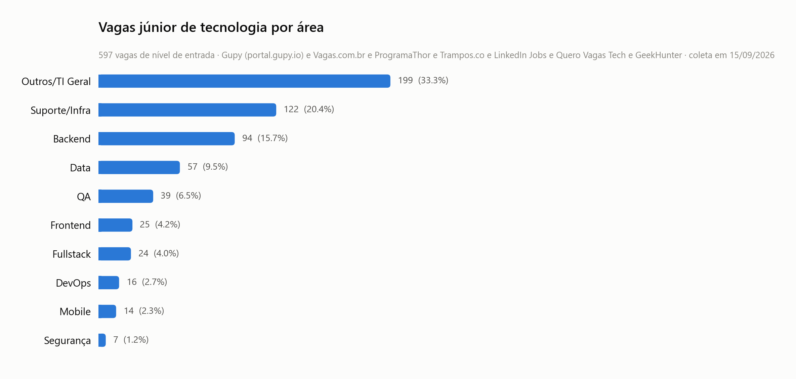
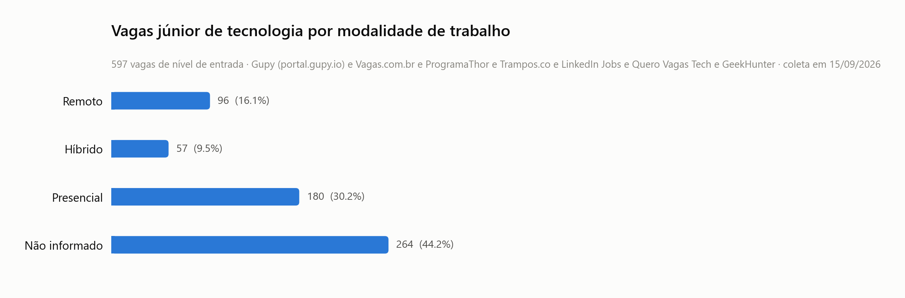
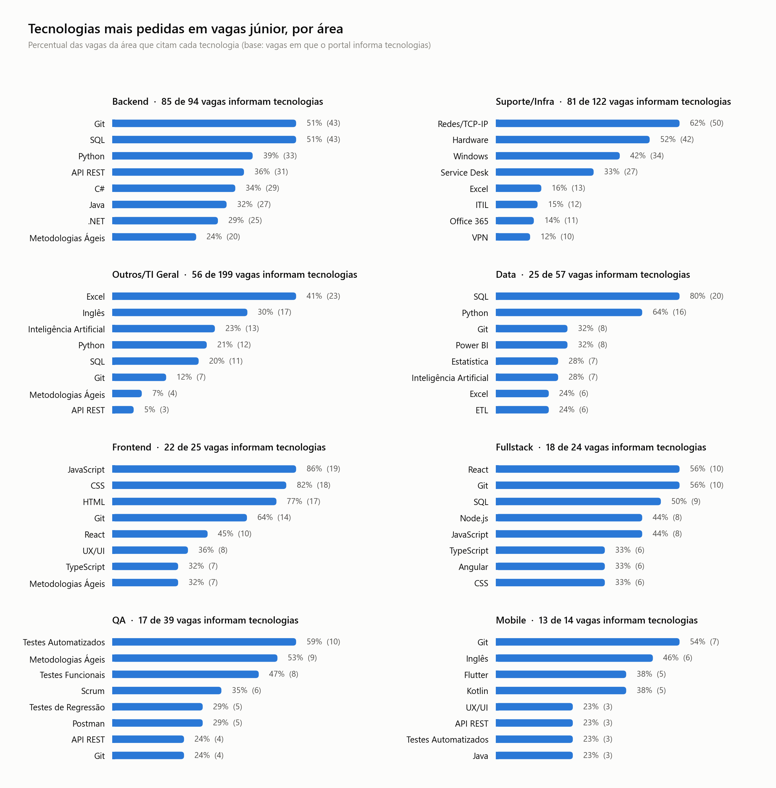

# Resultados da coleta de 15/09/2026

> **Foto de uma data, não número atual.** Este relatório registra a análise da
> coleta de 15/09/2026, feita a partir do CSV de `python main.py --csv`. Os números
> atualizados, com filtros e histórico, estão no dashboard:
> [vagas-tech-junior.streamlit.app](https://vagas-tech-junior.streamlit.app/).
> O dashboard lê o banco, então os totais podem diferir um pouco dos daqui (veja
> `dashboard/README.md`).

> **Coleta de 15/09/2026** — 1.597 vagas brutas de **sete portais** (Gupy,
> Vagas.com.br, ProgramaThor, Trampos.co, LinkedIn, Quero Vagas Tech e
> GeekHunter), das quais **597** sobraram depois de filtrar nível de entrada,
> remover duplicatas e descartar vagas fora de tecnologia. Os números abaixo
> são um retrato dessa data; rodar `python main.py` gera um novo.

| Etapa | Vagas |
|---|---|
| Coletadas nos sete portais | 1.597 |
| Depois do filtro de nível de entrada | 1.254 (−343) |
| Depois de remover duplicatas | 911 (−343) |
| Depois de descartar vagas fora de tecnologia | **597** (−314) |

| Portal | Vagas no resultado final |
|---|---|
| LinkedIn | 244 (40,9%) |
| Quero Vagas Tech | 163 (27,3%) |
| Gupy | 130 (21,8%) |
| GeekHunter | 35 (5,9%) |
| Vagas.com.br | 19 (3,2%) |
| ProgramaThor | 5 (0,8%) |
| Trampos.co | 1 (0,2%) |

## Qual área mais contrata júnior

| # | Área | Vagas | % |
|---|------|-------|---|
| 1 | Outros/TI Geral | 199 | 33,3% |
| 2 | Suporte/Infra | 122 | 20,4% |
| 3 | Backend | 94 | 15,7% |
| 4 | Data | 57 | 9,5% |
| 5 | QA | 39 | 6,5% |
| 6 | Frontend | 25 | 4,2% |
| 7 | Fullstack | 24 | 4,0% |
| 8 | DevOps | 16 | 2,7% |
| 9 | Mobile | 14 | 2,3% |
| 10 | Segurança | 7 | 1,2% |

**Entre as áreas identificáveis, Suporte/Infra continua na frente** — 122 vagas
contra 94 de Backend, a segunda colocada. É a porta mais larga para quem está
começando, e não costuma ser a primeira escolha de quem entra na área.

É a **terceira coleta seguida com a mesma resposta**, cada uma com mais fontes:
182 vagas de 2 portais, depois 374 de 5 e agora 597 de 7. A distância para
Backend diminuiu, mas a ordem nunca inverteu — um indício de que o resultado não
é artefato de amostra pequena.

As áreas que mais ganharam espaço foram **Data** (de 5,3% para 9,5%) e **QA**
(de 4,5% para 6,5%).

O primeiro lugar da tabela, "Outros/TI Geral", **não é uma área** — é o balde
das vagas cujo título não permite inferir a área ("ANALISTA DE SISTEMAS JR",
"Analista de Desenvolvimento Júnior"). **110 das suas 199 vagas vêm do
LinkedIn**, cujo card de busca não traz descrição e deixa só o título para
classificar. O balde encolheu de 38,5% para 33,3% porque as duas fontes novas
trazem a descrição completa. Preferi manter essas vagas explícitas a
distribuí-las por chute.

## Remoto, híbrido ou presencial

| Modalidade | Vagas | % do total | % entre as informadas |
|---|---|---|---|
| Não informado | 264 | 44,2% | — |
| Presencial | 180 | 30,2% | 54,1% |
| Remoto | 96 | 16,1% | 28,8% |
| Híbrido | 57 | 9,5% | 17,1% |

A fatia sem modalidade caiu de 60% para 44%, porque as duas fontes novas
informam a modalidade em praticamente toda vaga. O que continua sem informação é
o LinkedIn inteiro (244 vagas) e 19 do Vagas.com — nenhum dos dois distingue
presencial de híbrido no card de listagem.

A leitura honesta é a última coluna, restrita às 333 vagas em que o portal
informa: **mais da metade é presencial**. As remotas subiram de 14% para 29%,
mas isso pede cuidado: **64 das 96 vagas remotas vêm da Quero Vagas Tech**, um
agregador com muita vaga remota. Sem ela, seriam 32 remotas em 171 informadas —
19%. Boa parte do salto é mudança na mistura de fontes, não no mercado.

Por área, **Backend concentra 26 das 96 vagas remotas**, seguido de Frontend
(14), Data (9) e QA (9). Quem busca trabalho remoto júnior continua, na
prática, olhando para Backend.

## Tecnologias mais pedidas

| Tecnologia | Vagas | | Tecnologia | Vagas |
|---|---|---|---|---|
| SQL | 102 | | Metodologias Ágeis | 54 |
| Git | 98 | | JavaScript | 54 |
| Python | 79 | | Inteligência Artificial | 51 |
| Inglês | 65 | | Java | 48 |
| Redes/TCP-IP | 65 | | Hardware | 48 |
| API REST | 55 | | Excel | 46 |

**SQL passou a liderar o geral** e segue como a habilidade mais transferível
entre as áreas com mais vagas. Inglês, que liderava na coleta anterior, caiu para
o quarto lugar. **Inteligência Artificial** chegou a 51 menções, mais que o dobro
das 24 anteriores.

### O gráfico por área é percentual, não contagem

As áreas têm tamanhos muito diferentes (199 vagas em "Outros/TI Geral" contra 7
em Segurança), então contagem absoluta não deixa comparar um painel com o outro.
E a base do percentual **não é o total da área**: é o número de vagas que
*informam* alguma tecnologia. Nem toda vaga informa — o card do LinkedIn não traz
descrição, então em "Outros/TI Geral" só 56 das 199 vagas têm tecnologia. Cada
painel declara a própria base, e áreas com menos de 6 vagas nessa base ficam
fora do gráfico.

A proporção muda a leitura: em números absolutos, **SQL aparece em mais vagas de
Backend (43) que de Data (20)**. Em proporção, é o contrário — **80% das vagas
de Data pedem SQL, contra 51% das de Backend**. Data é a área mais concentrada
em SQL do dataset; Backend distribui mais entre linguagens (Python 39%, C# 34%,
Java 32%).

**Para quem mira Data**, depois de SQL (80%) e Python (64%) vêm Power BI e Git
(32% cada), e o Excel caiu de 47% para 24%. Ferramentas de engenharia de dados
aparecem, mas ainda são minoria: Databricks em 4 das 25 vagas com tecnologia
informada, Airflow e Spark em 3, dbt em 1. A base é pequena, então vale como
indício, não como tendência.

Duas áreas onde a proporção diz mais que o total: **Suporte/Infra é dominada por
Redes/TCP-IP (62%), Hardware (52%) e Windows (42%)** — nada de programação no
topo; e **Frontend pede JavaScript em 86%** das vagas, o maior percentual de uma
linguagem específica em qualquer área, seguido de CSS (82%) e HTML (77%).

---

Como esses números foram apurados e as limitações conhecidas: seções
[Como esses números foram apurados](../README.md#como-esses-números-foram-apurados)
e [Limitações honestas](../README.md#limitações-honestas) do README.
